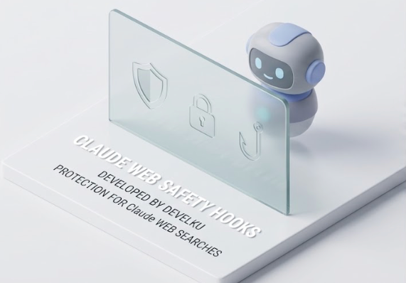

<p align="center">
  
</p>

# Claude Web Safety

<p align="center">
  <a href="https://github.com/develku/claude-web-safety-hooks/actions/workflows/tests.yml"></a>
</p>

Defense-in-depth hooks for [Claude Code](https://docs.anthropic.com/en/docs/claude-code) that protect against **prompt injection from web content**. Distributed as a Claude Code plugin.

When Claude Code fetches web pages or searches the web, the returned content could contain hidden instructions designed to manipulate Claude's behavior. These hooks screen URLs before fetching, scan returned content against 600+ injection patterns across 8 evasion-resistant views, and surgically redact attacks before Claude sees them.

## How it works

Six layers, each documented in [docs/patterns.md](docs/patterns.md):

| Layer | When | What |
|---|---|---|
| **1. URL pre-screening** | PreToolUse | Block dangerous schemes, SSRF targets, IP addrs, credential leaks, open redirects, high-risk TLDs |
| **2. Severity-tiered scanner** | PostToolUse | 600+ patterns across HIGH/MEDIUM/LOW; 8 evasion views (whitespace, HTML entities, punctuation, Unicode confusables, URL-decoded, tag-stripped) |
| **3. Content sanitization** | PostToolUse | HIGH = full redaction; MEDIUM = surgical line-by-line; output capped at 50KB |
| **4. Cross-tool correlation + reassembly** | PostToolUse | 5-min window; 3+ flagged tools auto-escalate MEDIUM → HIGH. **v6.0+ also detects payloads split across multiple fetches** (`Part 1/3: ignore` + `Part 2/3: previous` + `Part 3/3: instructions` → reassembled match) |
| **5. Structural verification** | PostToolUse | Code-fence / YAML / JSON / HTML-code / inline-code aware — clears false positives like `assistant:` inside doc snippets without bothering the user |
| **6. Outbound exfiltration guard** | PreToolUse (Bash + web-fetch) | When a HIGH injection was flagged in this session in the last 5 min, escalates outbound data flows — **mode-aware**: an interactive confirmation in modes that surface one, a hard block in `bypassPermissions`/`auto`/`dontAsk` (where a confirmation is silently discarded by the harness). Breaks the inject→exfil chain. Covers network-egress Bash commands (`curl`/`wget`/`scp`/`rsync`/`ssh`/`nc`/`socat`/`/dev/tcp`/inline `python -c`/`node -e`, **DNS tunneling via `dig`/`nslookup`, and `git push`**) **and** web-fetch tools (a fetch to a non-allowlisted host while armed — the most natural post-injection exfil). Trusted destinations via `url-allowlist.txt`, but an *upload* to an allowlisted host is not exempted; kill switch `WEB_SAFETY_EGRESS_GUARD_DISABLE=1` |

## Architecture

The plugin is pure shell — no daemon, no dependencies beyond `jq`/`perl`/`shasum`. `hooks/hooks.json` wires each script to a Claude Code tool event; the scripts communicate through session-scoped files in `/tmp`.

```
web-safety/
├── hooks/hooks.json                  # wires scripts → tool events (matchers below)
├── scripts/
│   ├── web-safety-approve.sh         # Layer 1   — PreToolUse(web)  URL pre-screen
│   ├── web-safety-scanner.sh         # Layers 2–5 — PostToolUse(web) scan + sanitize; arms Layer 6
│   ├── web-safety-egress.sh          # Layer 6   — PreToolUse(Bash) outbound exfiltration guard
│   ├── web-safety-verify-context.sh  # Layer 5   — structural-verification helper
│   ├── web-safety-listctl.sh         # backs /web-safety-allow + /web-safety-block
│   └── web-safety-report.sh          # backs /web-safety-report
├── commands/                         # 4 user-invoked slash commands (auto-discovered)
├── tests/                            # 5 suites · 236 cases · Linux+macOS CI
└── docs/                             # patterns.md, tuning.md, design specs
```

### Hook wiring

| Event | Matcher | Script | Layer(s) |
|---|---|---|---|
| **PreToolUse** | `WebFetch` / `WebSearch` / MCP web tools | `web-safety-approve.sh` → `web-safety-egress.sh` | 1, 6 |
| **PreToolUse** | `Bash` | `web-safety-egress.sh` | 6 |
| **PostToolUse** | `WebFetch` / `WebSearch` / MCP web tools | `web-safety-scanner.sh` (10s timeout) | 2–5 (+ arms 6) |

Layer 6 runs on the web matcher as well as `Bash` (since v7.5.0): while armed, an outbound fetch to a non-allowlisted host is escalated just like a Bash egress command.

### Runtime data flow

Hooks are short-lived processes with no shared memory, so cross-step state lives in session-keyed `/tmp` files (keyed on `${CLAUDE_SESSION_ID:-$PPID}`, so one session never affects another):

```
 fetch requested
      │
      ▼  PreToolUse(web)
 [Layer 1] approve.sh ── block dangerous URL / pass ──► fetch runs
                                                          │
                                                          ▼  PostToolUse(web)
                            [Layers 2–5] scanner.sh ── scan · sanitize · correlate
                                   │ writes
                                   ├─► /tmp/web-safety-session-<id>-state      (hit log → Layer 4 escalation)
                                   ├─► /tmp/web-safety-session-<id>-fragments  (split-payload reassembly → Layer 4)
                                   └─► /tmp/web-safety-session-<id>-armed       (timestamp, on HIGH → arms Layer 6)
                                                          │
 later: a Bash command OR a web fetch ──► PreToolUse(Bash/web)  │ reads
                            [Layer 6] egress.sh ───────────────────┘
                                   armed + egress/outbound-fetch + non-allowlisted host → permissionDecision:"ask"
```

User-side config and audit live under `~/.claude/hooks/`: `url-allowlist.txt`, `url-blocklist.txt`, and the append-only `web-safety.log`.

## Install

```
/plugin marketplace add develku/claude-web-safety-hooks
/plugin install web-safety@develku
/reload-plugins
```

That's it. The matchers cover `WebFetch`, `WebSearch`, and a wide set of MCP web tools (Playwright, Puppeteer, Firecrawl, Exa, Context7, MCP Docker variants).

## Quick start

```bash
# (Optional) add a URL allowlist to skip the soft-block checks on trusted domains
mkdir -p ~/.claude/hooks
echo "github.com" >> ~/.claude/hooks/url-allowlist.txt
echo "anthropic.com" >> ~/.claude/hooks/url-allowlist.txt

# (Optional) add a URL blocklist
echo "malware-distribution.example.com" >> ~/.claude/hooks/url-blocklist.txt

# Trigger a test
# Ask Claude: "fetch https://blog.cyberdesserts.com/prompt-injection-attacks/"
# You should see a desktop notification (macOS sounds Basso/Sosumi/Ping, or Linux notify-send
# at matching urgency) and Claude pauses.

# Check the audit log
tail -20 ~/.claude/hooks/web-safety.log
```

See [docs/tuning.md](docs/tuning.md) for environment variables, severity tuning, allowlist/blocklist details, and false-positive workflow.

## Commands

Four slash commands ship with the plugin (auto-discovered on install). All are user-invoked only (`disable-model-invocation: true`) and run through the helper scripts above:

| Command | Args | What |
|---|---|---|
| `/web-safety-report` | `[days]` | Markdown summary of the audit log — counts by severity, top tools, top hosts, recent events. Optional day window. Read-only; never mutates the log. |
| `/web-safety-allow` | `<domain>` | Validate + append a trusted domain to `url-allowlist.txt`. Relaxes **soft** blocks only (high-risk TLD, custom blocklist) — hard blocks (SSRF/internal targets, IPs, dangerous schemes, credentials-in-URL) still apply. |
| `/web-safety-block` | `<domain>` | Validate + append a domain to `url-blocklist.txt` — rejected before any fetch. |
| `/web-safety-trust` | `<domain>` | Validate + append a domain to `url-content-trust.txt` — **downgrades the content scan** for that source (no halt, no redaction) so you can read security articles that quote attack strings, while still logging `[TRUST-DOWNGRADE]` and arming the Layer 6 backstop. Distinct from `allow`. |

## Requirements

- Claude Code CLI
- `jq`, `bash` 3.2+, `perl`, `shasum`
- macOS, Linux, or Windows for desktop notifications — macOS via `osascript`, Linux via `notify-send` (libnotify) with best-effort sound (`canberra-gtk-play`/`paplay`/`pw-play`), Windows via a WinRT toast through `powershell.exe` (Git Bash / WSL); detection itself needs none of these and runs anywhere

## Update log

Full per-version detail in [CHANGELOG.md](CHANGELOG.md). Recent releases:

- **7.12.0** — Layer 6 **mode-aware enforcement** + two new exfil channels. The guard previously emitted only `permissionDecision:"ask"`, which the harness *silently discards* in `bypassPermissions`/`auto`/`dontAsk` modes — so for anyone running permission-skip, Layer 6 detected and logged but never actually stopped an exfil. It now reads the hook's `permission_mode` and, in those modes, emits a hard `{decision:"block"}` (the same mechanism the URL pre-screen uses, empirically honored under bypass) while preserving the interactive `ask` in `default`/`acceptEdits`/`plan`. Channel coverage gains **DNS tunneling (`dig`/`nslookup`/`drill`) and `git push`** — both previously documented evasion gaps — with `git push` to an allowlisted remote staying exempt and false-positive guards for `git commit -m "…push…"`, `git pull`, and `digest`/`prodigy` substrings. Escape a wrong block via `url-allowlist.txt` or `WEB_SAFETY_EGRESS_GUARD_DISABLE=1`. Egress suite → 92 cases (now 5 suites · 236 cases).
- **7.11.0** — Per-source **content-trust downgrade**: a new `url-content-trust.txt` list (and `/web-safety-trust <domain>`) tells the scanner to keep *detecting* on a trusted source but *downgrade the action* — no halt, no redaction — so you can read security articles that quote attack strings without the scanner deleting the very content you fetched. It still writes a `[TRUST-DOWNGRADE]` audit line (surfaced by `/web-safety-report`), still arms the Layer 6 exfiltration guard as the backstop, fires a non-blocking notification when it passes would-be-redacted patterns through, and deliberately doesn't feed cross-tool escalation. Distinct from `url-allowlist.txt` (soft URL pre-blocks only); hard URL blocks are unaffected. New `run-trust-tests.sh` suite → 21 cases (now 5 suites · 215 cases).
- **7.10.0** — Windows toast notifications complete the cross-platform set: `_notify_windows` raises a WinRT toast via `powershell.exe` (severity → `ms-winsoundevent` sound), with WSL preferring in-distro `notify-send` when a display is present. Title/body cross to PowerShell as env vars (never interpolated into the command), and PowerShell is the authoritative sanitizer — it strips XML-illegal chars + CR/LF before `LoadXml` (closing an alert-suppression DoS where a raw control char would make the toast silently fail) then `SecurityElement::Escape`s. Notify suite → 21 cases; a CI step parse-checks the embedded toast PowerShell with `pwsh`.
- **7.9.0** — Desktop notifications are now cross-platform: a new `web-safety-notify.sh` dispatcher routes the three notification sites (scanner alerts, exfiltration guard, URL pre-block) to macOS `osascript` or Linux `notify-send` (best-effort sound), detecting macOS/Linux/WSL/Windows and degrading to a silent no-op when no notifier/display is present. Per-platform sanitization replaces the macOS-only quote/backslash strip — Linux uses a `--` option-injection guard + Pango-markup escaping + C0/DEL control strip — and the dispatcher never writes to the hook's JSON stdout. macOS behaviour is byte-identical (all prior suites green). New `run-notify-tests.sh` suite → 15 cases. (Windows toast lands in a follow-up.)
- **7.8.0** — Emoji false-positive pass verified against the full Unicode emoji corpus (3,944 glyphs): the variation-selector check now requires a run of ≥2 (was firing on every `FE0F` emoji like ⚠️ ❤️), the zero-width check requires ASCII-adjacency (was firing on every ZWJ emoji — families, professions, 🏳️‍🌈), and the HIGH tag-char check strips the 3 real subdivision flags by exact region code before flagging residue (England/Scotland/Wales flags were being *blocked + sanitized*). Scanner suite → 53 cases.
- **7.7.0** — Minor roll-up completing a 15-finding review: leetspeak loop now reports every obfuscated pattern (not just the first), escalation tool list renders with a real `, ` separator, `listctl` add is atomic, the `SESSION_STATE` prune is lock-guarded, and the allowlist honors a final entry without a trailing newline.
- **7.6.0** — Closed two HIGH false-negatives: base64 detection strengthened (CR/LF-stripping, lower threshold, decode-vs-real-patterns) and cross-call reassembly evasions (head+tail excerpt, completing-fragment capture, full 14-category lexicon). Affix index made per-word + fired-set de-dup after the gate found an FP-storm.
- **7.5.0** — Layer 6 now also guards the **web-fetch** channel (fetch to a non-allowlisted host while armed) and adopts the shared host library; upload-aware allowlist (an upload *to* an allowlisted host is no longer exempt).
- **7.4.0** — Object-shaped `tool_response` is now scanned, broadened MCP tool matcher, false-positive fixes, and audit-log→report injection closed (control-char-stripped URLs, backtick neutralization).
- **7.3.0** — Closed an SSRF pre-screen bypass (decimal/hex/octal-IP, userinfo, `*.internal`, metadata hosts via a canonical host normalizer), a large-input fail-open (input cap + truncation note), a no-op hex HTML-entity decode, and a verifier regex flaw that auto-cleared genuine `[INST]` injections; test harness hardened.
- **7.2.0** — macOS notifications now show the cause (matched patterns / outbound command / blocked URL) in the body + subtitle instead of generic text; osascript sanitizer hardened to strip backslashes (display-only, detection unchanged).
- **7.1.0** — Layer 6 hardening from an adversarial stress test (~130 vectors): fixes an interpreter-flag evasion (`python3 -u -c …`) and a path-component false positive (`ls ~/.ssh/`), expands coverage (`rsync`, `ssh`, `socat`, `telnet`, `openssl s_client`, `/dev/tcp`); egress suite → 50 cases.
- **7.0.0** — Layer 6 outbound exfiltration guard: PreToolUse(`Bash`) hook escalating egress to a confirmation after a HIGH injection flag, breaking the inject→exfil chain.
- **6.3.1** — fix: slash-command `${CLAUDE_PLUGIN_ROOT}` brace-substitution.
- **6.3.0** — slash commands (`/web-safety-report`, `/web-safety-allow`, `/web-safety-block`) + cross-platform CI test matrix.
- **6.2.0** — plugin-only installation; manual install path removed.
- **6.1.1** — confusable-letter bridge fix from stress testing.
- **6.1.0** — letter-boundary + affix-only limitation closures.
- **6.0.0** — cross-call payload reassembly (E8).

## Tests

```bash
./tests/run-tests.sh        # scanner — 53 cases
./tests/run-cmd-tests.sh    # command helpers — 49 cases
./tests/run-egress-tests.sh # Layer 6 egress guard — 92 cases
./tests/run-notify-tests.sh # cross-platform notification dispatcher — 21 cases
./tests/run-trust-tests.sh  # content-trust downgrade — 21 cases
```

53 scanner cases (single-fetch payloads + multi-fetch reassembly sequences + enforcement / large-input / performance assertions) across HIGH/MEDIUM/LOW/legit/reassembly buckets, covering all 8 evasion views, base64-encoded payloads, hex/decimal HTML-entity decoding, Layer-5 false-positive guards, multi-pattern HIGH combinations, ordering-token reorder attacks, cross-session isolation, letter-boundary and tail-split reassembly, already-fired suppression, 3-char affix-only fragments, confusable-letter bridges, multi-technique leetspeak, emoji false-positive guards (variation-selector / ZWJ / subdivision-flag, verified against the full 3,944-emoji Unicode corpus), and a 256 KB-page performance budget. A second suite (`run-cmd-tests.sh`) covers the report and allow/block helper scripts — including atomic/concurrent list adds, allowlist normalization, and SSRF hard-block classes through the pre-screen. A third (`run-egress-tests.sh`) covers the Layer 6 outbound exfiltration guard across **both** the Bash and web-fetch channels — arm-state production, the mode-aware enforcement decision (interactive `ask` in ask-honoring modes vs hard `block` in `bypassPermissions`/`auto`/`dontAsk`, with backward-compatible `ask` when no `permission_mode` is present), the DNS-tunneling (`dig`/`nslookup`) and `git push` channels with their false-positive guards, allowlist exemption and upload-aware non-exemption, session isolation, and path-qualified-binary boundary cases. A fourth (`run-notify-tests.sh`) covers the cross-platform notification dispatcher — platform detection (macOS/Linux/WSL/Windows), the Linux `--` option-injection guard, Pango-markup escaping and C0/DEL control strip, the headless (no-DBUS) skip, the Windows toast contract (env-var passing, control/CRLF strip, `ms-winsoundevent` mapping, no-powershell fail-safe), and the hard invariant that a noisy notifier never leaks onto the hook's JSON stdout. A fifth (`run-trust-tests.sh`) covers the per-source content-trust downgrade — that a trusted host's HIGH/MEDIUM detection passes through unredacted and unhalted while still logging `[TRUST-DOWNGRADE]` and arming Layer 6, that subdomains match, that a trust entry never globally exempts other hosts, that clean content on a trusted host fabricates nothing, that downgrades don't pollute cross-tool escalation, and the `listctl trust` validation. All five run in CI on a Linux + macOS matrix, where a `pwsh` step also parse-checks the embedded Windows toast PowerShell (no Windows runner exists, so this guards against a syntax error silently breaking the toast). See [tests/README.md](tests/README.md).

## License

[MIT](LICENSE).
